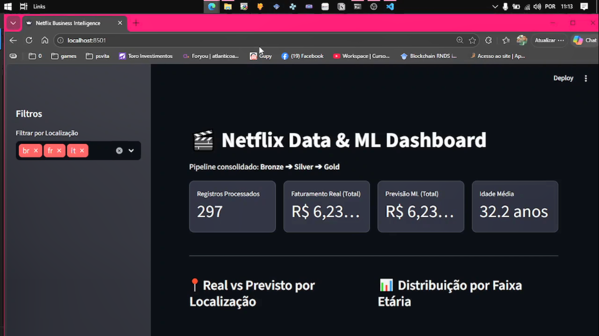

# Pipeline de Dados Netflix com Orquestração



Este projeto demonstra a construção de um pipeline de dados de ponta a ponta, utilizando o dataset público (Netflix marketing) como fonte. O pipeline processa dados através de camadas (Bronze, Silver, Gold), valida qualidade com Great Expectations, disponibiliza a camada final em PostgreSQL e apresenta os resultados em um dashboard interativo com Streamlit.

## Arquitetura do Projeto

O pipeline segue a arquitetura Medalhão:

-   **Camada Bronze (Bruta):** Download de planilhas do repositório público, enriquecimento com UTM e persistência em Parquet.
-   **Camada Silver (Tratada):** Consolidação, codificação de variáveis e salvamento em Parquet; validado com **Great Expectations**.
-   **Camada Gold (Enriquecida):** Aplicação de um modelo simples de ML (RandomForest) e carga do resultado no **PostgreSQL**.
-   **Dashboard:** Visualização dos dados da camada Gold com **Streamlit**.

### Stack Tecnológica

-   **Luigi:** orquestração de tarefas com dependências explícitas.
-   **Pandas:** transformação e limpeza de dados.
-   **Parquet + PyArrow:** formato de arquivo colunar eficiente.
-   **Great Expectations:** validação e documentação da qualidade dos dados.
-   **Streamlit:** criação de dashboards interativos.
-   **scikit-learn:** `RandomForestRegressor` para gerar a coluna `previsao_amount`.
-   **SQLAlchemy + psycopg2:** persistência da camada Gold no PostgreSQL.
-   **Poetry:** gerenciamento de dependências e ambiente virtual.
-   **Devbox:** shell determinístico para ferramentas de desenvolvimento.
-   **Docker Compose:** provisionamento do ambiente de produção e banco de dados.
-   **Prometheus & Grafana:** (Planejado) Monitoramento do pipeline.

### Observações Importantes

-   **Prometheus e Grafana:** A configuração de monitoramento com Prometheus e Grafana está planejada, mas ainda não foi implementada. Esta é uma tarefa futura para quando houver maior senioridade no projeto e uma compreensão mais profunda da arquitetura de monitoramento.

## Como Executar o Projeto

Siga os passos abaixo para configurar e executar o pipeline completo.

### 1. Setup Inicial

Primeiro, clone o repositório. Em seguida, execute o script `start` para gerar a estrutura de arquivos de suporte (Devbox, Great Expectations).

```bash
./start
```

### 2. Instalação das Dependências

Este projeto usa Poetry para gerenciar as dependências. Instale tudo o que é necessário com o `Makefile`.

```bash
make install
```

### 3. Execução do Pipeline

**Importante:** Antes de executar o pipeline, especialmente se você já o rodou antes, é crucial limpar os dados antigos para forçar um reprocessamento completo.

```bash
make clean
```

Após a limpeza, execute o pipeline. O comando a seguir utiliza Docker para orquestrar os serviços e executar o pipeline em um ambiente isolado.

```bash
make full-run
```
Este comando irá construir as imagens Docker (se necessário), subir os serviços (como o banco de dados) e executar as tarefas do Luigi da Bronze até a Gold.

### 4. Visualizando o Dashboard com Streamlit

Após a conclusão bem-sucedida do pipeline, os dados estarão na camada Gold e prontos para visualização. Para iniciar o dashboard interativo, execute o seguinte comando:

```bash
poetry run streamlit run src/scripts/dashboard/app.py
```
O Streamlit fornecerá uma URL local (geralmente `http://localhost:8501`) que você pode abrir em seu navegador.

### 5. Validações de Qualidade (Great Expectations)

Após a execução do pipeline, os Data Docs do Great Expectations estarão disponíveis. Eles fornecem um relatório detalhado sobre a qualidade dos dados na camada Silver.

Para visualizar, abra o seguinte arquivo no seu navegador:
`great_expectations/uncommitted/data_docs/local_site/index.html`

### Comandos Úteis (Makefile)

-   `make install`: Instala dependências com Poetry.
-   `make clean`: Remove a pasta `data/` para uma nova execução.
-   `make full-run`: Instala, limpa e roda o pipeline do zero via Docker.
-   `make run`: Sobe os serviços via Docker Compose e executa o pipeline (sem limpar os dados).
-   `make down`: Para os contêineres Docker.